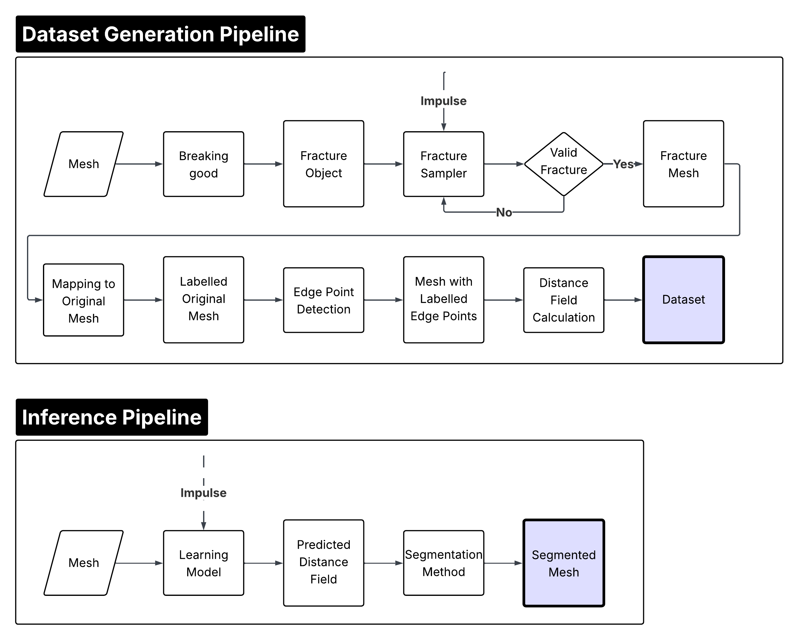
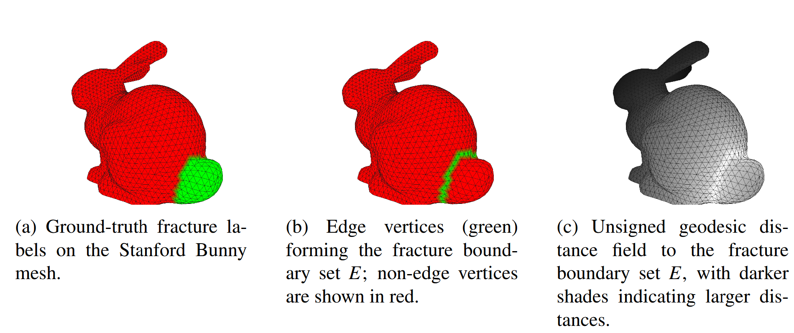

# Thesis Point Cloud Dataset Generation

Dataset-generation pipeline for my MSc thesis **“Learning Unsigned Distance Fields to Simulate Brittle Fractures in Real-Time”** at TU Delft.

This repository contains the data-generation part of the project. It creates impulse-dependent brittle fracture samples for a given mesh and converts the resulting fracture labels into surface-based unsigned distance fields (UDFs). These samples are then used to train machine learning models for fracture prediction.

## Project context

Real-time fracture simulation is challenging because physically accurate fracture methods are usually too expensive for interactive applications such as games or simulation prototypes. This thesis explores whether brittle fracture behaviour can instead be approximated with machine learning.

Rather than directly learning fracture-piece labels, which are arbitrary and difficult to compare across samples, the project represents each fracture pattern as an unsigned distance field over the mesh surface. This gives the learning model a continuous target: the distance from each vertex to the nearest fracture boundary.

## Pipeline overview

The dataset pipeline generates fractures for a mesh under different impact configurations, maps the resulting labels back to the original mesh, detects fracture-boundary vertices, and computes an unsigned geodesic distance field over the mesh surface.

## Unsigned distance field generation

Instead of directly learning arbitrary fracture labels, the thesis represents fracture patterns as a distance field. Vertices close to fracture boundaries receive low UDF values, while vertices farther from cracks receive higher values.

## What this repository does

This repository focuses on the preprocessing and dataset-construction stage of the thesis. The generated data is used by the companion machine learning repository for training, evaluation, and segmentation experiments.

Main functionality:

- Load and process watertight 3D meshes
- Generate multiple fracture samples for a single mesh
- Sample impact positions and impact directions
- Store impulse-dependent fracture information
- Detect fracture-boundary vertices from generated labels
- Compute unsigned geodesic distance fields on the mesh surface
- Export data for downstream model training

## Method summary

For each mesh, the pipeline generates fracture samples under varying impact conditions. Each fracture sample contains the mesh, the impact information, the resulting fracture labels, and a surface-based UDF.

The UDF is computed using geodesic distances along the mesh surface. This is important because the model is trained on surface geometry rather than a full volumetric representation. By avoiding volumetric grids, the thesis focuses on a lighter representation that is more suitable for real-time applications.

## Role in the thesis

This repository provides the dataset used to train models that predict fracture-aware distance fields from impact information. It supports the first stage of the full thesis pipeline:

1. Generate fracture data
2. Convert fracture labels to UDF targets
3. Train a model to predict UDFs
4. Segment predicted UDFs into fracture pieces

The learning, evaluation, and segmentation stages are handled in the companion repository.

## Related repository

The machine learning and evaluation code is available in the companion repository:

- [`pointnet.pytorch`](https://github.com/LukasZim/pointnet.pytorch)

## Thesis

**Learning Unsigned Distance Fields to Simulate Brittle Fractures in Real-Time**  
MSc Computer Science, TU Delft  
Author: Lukas Kai Zimmerhackl

## Keywords

`computer graphics` · `fracture simulation` · `mesh processing` · `point clouds` · `unsigned distance fields` · `dataset generation` · `real-time graphics`
